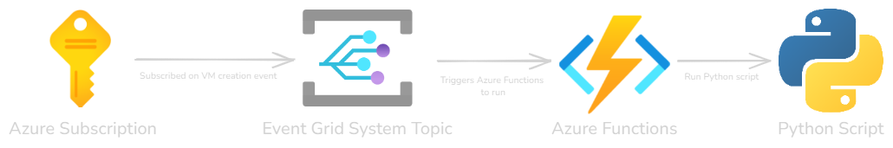

# Automate the observability of your VMs using Python

This script installs the Azure Monitor Agent on an Azure Virtual Machine using the Azure SDK for Python. Supported OS: Linux & Windows.

Once the AMA is being deployed, it will be associated with the specified Data Collection Rule specified in the script. In case the user wants to enable the VM Insights feature on the VM, the ARM template of this DCR is provided in the repo as well under vminsightsdcr.json. This can be deployed to Azure via the custom template deployment in Azure or through PowerShell or Azure CLI.

## Resources - Azure

* [Azure Monitor](https://learn.microsoft.com/en-us/azure/azure-monitor/)
* [Azure Monitor Agent: introduction](https://learn.microsoft.com/en-us/azure/azure-monitor/agents/azure-monitor-agent-overview)
* [Data collection rule: introduction](https://learn.microsoft.com/en-us/azure/azure-monitor/agents/azure-monitor-agent-data-collection)

## Prerequisites

- Python 3.x
- Azure SDK for Python
- Git ([how to download](https://git-scm.com/downloads))
- Azure credentials (Tenant ID, Client ID, Client Secret). [Tutorial on how to create this.](https://learn.microsoft.com/en-us/entra/identity-platform/quickstart-register-app?tabs=client-secret). Note: store the ClientSecret somewhere as it will not be displayed again after creation.

Next prerequisites only apply if you want to automate the script using Azure Functions:

- Azure CLI ([how to install](https://learn.microsoft.com/en-us/cli/azure/install-azure-cli))
- Azure Functions Core Tools ([how to install](https://learn.microsoft.com/en-us/azure/azure-functions/functions-run-local?tabs=windows%2Cisolated-process%2Cnode-v4%2Cpython-v2%2Chttp-trigger%2Ccontainer-apps&pivots=programming-language-python#install-the-azure-functions-core-tools))
- Visual Studio ([how to download](https://code.visualstudio.com/Download))
- Azure Functions Extension on Visual Studio ([how to install](https://marketplace.visualstudio.com/items?itemName=ms-azuretools.vscode-azurefunctions))

**Note**: Ensure that your Linux or Windows OS version is supported by the Azure Monitor Agent. You can check the full list [here](https://learn.microsoft.com/en-us/azure/azure-monitor/agents/azure-monitor-agent-supported-operating-systems).

> If your VM is running on-premises or in a different cloud provider, you need to first Arc enable the VM.

In order to install the Azure Monitor Agent on Virtual Machines outside of Azure, it is required to onboard these VMs using the Azure Arc Agent. Using [following link](https://learn.microsoft.com/en-us/azure/azure-arc/servers/deployment-options), you will find multiple onboarding options: Group Policy, PowerShell, SCVMM, Service Principal...
## Installation of environment

1. Clone the repository or download the script ([how does this work?](https://docs.github.com/en/repositories/creating-and-managing-repositories/cloning-a-repository))
    ```sh
    git clone https://github.com/claestom/AMA-deployment---DCR-association--Linux-Windows-.git
    ```
2. Go to the cloned repository
    ```sh
    cd "AMA-deployment---DCR-association--Linux-Windows-"
    ```
3. Create a new virtual environment
    ```sh
    python -m venv .
    ```
4. Activate the new virtual environment
    
    *Powershell*
    ```sh
    .venv\Scripts\Activate.ps1 or Scripts\Activate.ps1
    ```
    *Command Prompt Windows*
    ```sh
    .venv\Scripts\activate.bat or Scripts\activate.bat
    ```
    *Mac/Linux*
    ```sh
    .venv/bin/activate or bin/activate
    ```
5. Install the required Python packages:
    ```sh
    pip install -r requirements.txt
    ```

### Data Collection rule

Data collection rules (DCRs) are stored in Azure so they can be centrally deployed and managed like any other Azure resource. They're sets of instructions supporting data collection using the Azure Monitor pipeline. More information [here](https://learn.microsoft.com/en-us/azure/azure-monitor/essentials/data-collection-rule-overview).

* If you would like to enable VM Insights on the VM, you can leverage the [DCR ARM templates](dcr-templates) in this repository. 

    You can deploy this using following commands:

    *If you want to enable both Performance and Map experience of VM Insights*
    ```sh
    cd arm-templates/dcr-templates/PerfAndMapDcr
    ```
    *If you want to enable only Performance experience of VM Insights.*
    ```sh
    cd arm-templates/dcr-templates/PerfOnlyDCR
    ```
    
    Before deploying the DCR, first set following variables. Note: these are used again further in the script.

    ```sh
    $ResourceGroup = "<insert name>"
    $Location = "<set location>"
    $LogAnalyticsWorkspaceName = "<insert name>"
    $DCRName = "<insert name>"
    ```
    *For the above variables, the PowerShell syntax is being used. If you are using Command Prompt instead, replace the PowerShell variable syntax $Variable with %Variable%.*
    
    Create a resource group
    ```sh
    az group create --name $ResourceGroup --location $Location
    ```
    Create a Log Analytics Workspace
    ```sh
    az monitor log-analytics workspace create --resource-group $ResourceGroup --workspace-name $LogAnalyticsWorkspaceName --location $Location
    ```
    Retrieve the Resource ID of this Log Analytics Workspace by running following command:

    ```sh
    $LAWid=$(az monitor log-analytics workspace show --resource-group $ResourceGroup --workspace-name $LogAnalyticsWorkspaceName --query id --output tsv)
    ```
    Deploy the DCR template to Azure
    ```sh
    az deployment group create --resource-group $ResourceGroup --template-file DeployDcrTemplate.json --parameters WorkspaceResourceId=$LAWid WorkspaceLocation=$Location userGivenDcrName=$DCRName
    ```

    More information how to deploy this template can be found [here](https://learn.microsoft.com/en-us/azure/azure-monitor/vm/vminsights-enable-overview).

* If you want to only select a defined type of metrics and/or logs, you can customize your DCR by creating them yourself. How to do this is explained [here](https://learn.microsoft.com/en-us/azure/azure-monitor/essentials/data-collection-rule-create-edit?tabs=portal), with tools like the Portal, Az CLI, PS, APIs or ARM.

Once the DCR is being created, go to the DCR instance in the Portal and retrieve the Resource ID. You can find this ID if you go to JSON VIEW if you are in the DCR in the Portal (see red rectangle).


Or run following Azure CLI command:
```sh
az monitor data-collection rule show --resource-group $ResourceGroup --name <name selected> --query id --output tsv
```

## Assign permissions to the Service Principal 

1. Get ID of the Service Principal created

    ```sh
    $servicePrincipalId=$(az ad sp list --display-name <service-principal-name> --query "[].appId" --output tsv)
    ```
2. Define different roles to assign
    ```sh
    $roles = @("Log Analytics Reader", "Virtual Machine Contributor", "Monitoring Contributor") 
    ```
3. Assign the roles to the SP
    ```sh
    foreach ($role in $roles) { 
        az role assignment create --assignee $servicePrincipalId --role $role --scope /subscriptions/<subscription-id>
    } 
    ```
## Local usage to test

1. Enter the *local-script* folder
    ```sh
    cd ../../../local-script
    ```
2. Open Visual Studio
    ```sh
    code .
    ```
3. Create a new file called ".env" in the folder
4. Add to the .env file your Azure credentials and other required IDs in the script:
    ```python
    TENANT_ID=your-tenant-id
    CLIENT_ID=your-client-id
    CLIENT_SECRET=your-client-secret
    DATA_COLLECTION_RULE_ID=your-data-collection-rule-id
    ```

5. Run the script to install the VM extension:
    ```sh
    python script.py
    ```

## Integration with Azure Functions

The goal of integrating Azure Functions with our script is to enable automation. Azure Functions allows you to configure a trigger that initiates the script. In our case, the trigger will be the creation of a new virtual machine. To achieve this, we will integrate with Event Grid.

More information: [Azure Functions](https://learn.microsoft.com/en-us/azure/azure-functions/) and [Event Grid](https://learn.microsoft.com/en-us/azure/event-grid/overview).

In the next section, we will undertake following steps:

- Create an Azure Function App
- Develop an Azure Function locally using Visual Studio
- Deploy the code and configurations to Azure
- Create an Event Grid System Topic
- Create an Event Subscription on new Virtual Machines being created
- Subscribe the Azure Function App to the Event Grid Topic ([Event Grid Trigger](https://learn.microsoft.com/en-us/azure/azure-functions/functions-bindings-event-grid-trigger?WT.mc_id=AZ-MVP-5003203&tabs=python-v2%2Cisolated-process%2Cnodejs-v4%2Cextensionv3&pivots=programming-language-python))

High level the flow looks like this:

<p align="center">

</p>


### Get started:

#### Azure Functions

We will first create a resource group & storage account as these are required in order to create an Azure Function App. 

1.  Authenticate to Azure
    ```sh
    az login
    ```

2. Set variables

    *If working in PowerShell*:
    ```sh
    $StorageAccount = "<insert name>"
    $AzFunctionsName = "<insert name>"
    ```
    *If using Command Prompt*:
    ```sh
    SET StorageAccount = "<insert name>"
    SET AzFunctionsName = "<insert name>"
    ```
*Make sure to set a unique name for the Storage Account, as it needs to be **globally unique**. Also, take into account the following conditions: "Storage account name must be between 3 and 24 characters in length and use numbers and lower-case letters only."*

*In the following steps, I assume that PowerShell is being used. If you are using Command Prompt instead, replace the PowerShell variable syntax $Variable with %Variable%.*

3. Create a storage account
    ```sh
    az storage account create --name $StorageAccount --resource-group $ResourceGroup
4. Run following Azure CLI command
    ```sh
    az functionapp create --resource-group $ResourceGroup --name $AzFunctionsName --storage-account $StorageAccount --consumption-plan-location $Location --runtime python --os-type Linux
    ```
5. Navigate to the *azure-functions* folder within the cloned repository
    ```sh
    cd ../azure-functions
    ```
6. Open Visual Studio Code
    ```sh
    code .
    ```
7. You will receive following pop-up & Select **YES**. This will configure your environment.

<p align="center">

</p>

8. Go to the file explorer (top left) or press CTRL-SHIFT-E
9. Open **local.settings.json** and fill in your credentials & press CTRL-S
10. Run following command
    ```sh
    func azure functionapp publish $AzFunctionsName --publish-local-settings
    ```
IMPORTANT: When prompted with ***Would you like to overwrite value in azure? [yes/no/show]*** --> SELECT <b><u>NO</u></b>


#### Event Grid System Topic

You can deploy the Event Grid System Topic using following commands:

```sh
cd ../arm-templates/EventGridSystemTopic
```
Enter credentials in the [evgrid_parameters.json](arm-templates\EventGridSystemTopic\evgrid_template.json) file.

Next, run following command:
```sh
az deployment group create --resource-group $ResourceGroup --template-file evgrid_template.json --parameters evgrid_parameters.json
```

**Or if you prefer other experiences, below more information.**

1. Create an Event Grid System Topic: [Portal](https://learn.microsoft.com/en-us/azure/event-grid/create-view-manage-system-topics), [Azure CLI](https://learn.microsoft.com/en-us/azure/event-grid/create-view-manage-system-topics-cli) or [ARM template](https://learn.microsoft.com/en-us/azure/event-grid/create-view-manage-system-topics-arm)

    Take as Topic Type: Azure Resource Notifications - Resource Management events

2. Select the Event Grid System Topic
3. Select "+ Event Subscription"
4. Enter a name
5. Select for "Filter to Event Types": **Resource Created or Updated**
6. Select for EndpointType: **Azure Function**
7. Click on *Configure an endpoint*
8. Select your subscription, resourcegroup, Function App & Function. Next press **Confirm Selection**
9. Go to the **Filters** tab
10. Press *Add new filter* in the Advanced Filters section
11. As *Key*, enter: 
    ```sh
    data.resourceInfo.type
    ```
12. As *Operator*, select:
    ```sh
    String ends with
    ```
13. As *Value*, enter:
    ```sh 
    virtualMachines
    ```
14. Press **Create**

### Test by creating a VM and check whether the following happens: 
1. VM gets assigned a System Assigned Managed Identity
2. AMA gets deployed on the VM
3. VM gets associated with the defined DCR 
4. Data is flowing in

### Use of Tags

* In the [script](azure-functions\function_app.py) you will see on line 40 and 41 the option to insert tags key/value pairs. The goal of this is to allow filtering at a subscription or resource level.

    Example: you only want to enable monitoring on subscriptions with a specific tags (e.g., VMMonitoring = True). The same goes for VMs (e.g., you only want monitoring applied on VMs in production environment with tags Env = Prod).
* On line 45 you can select whether you want to enable the Dependency Map as well. More information about this feature [here](https://learn.microsoft.com/en-us/azure/azure-monitor/vm/vminsights-maps).

## Code Overview

### `script.py`

This is the main script that installs the VM extension and associates a Data Collection Rule with the VM. It includes the following key components:

#### Function: `install_vm_extension`

This function installs a the Azure Monitor Agent as a VM extension on an Azure VM.

- **Parameters**:
    - `compute_client`: The ComputeManagementClient instance.
    - `extension_name`: The name of the extension to install.
    - `vm`: The VM object.
    - `vm_name`: The name of the VM.
    - `resource_group`: The resource group of the VM.

- **Implementation**:
    ```python
    try:
        compute_client.virtual_machine_extensions.begin_create_or_update(
            resource_group_name=resource_group,
            vm_name=vm_name,
            vm_extension_name=extension_name,
            extension_parameters=extension_parameters
        ).result()
        print(f"{extension_name} installed on VM {vm_name}.")
    except HttpResponseError as e:
        print(f"Failed to install {extension_name} on VM {vm_name}. Error: {e}")
    ```

- **Review**:
    - The function attempts to install the VM extension and waits for the operation to complete using `.result()`.
    - It handles `HttpResponseError` exceptions and prints an error message if the installation fails.

#### Function: `associate_data_collection_rule`

This function associates a Data Collection Rule with an Azure VM.

- **Parameters**:
    - `monitor_client`: The MonitorManagementClient instance.
    - `vm`: The VM object.
    - `vm_name`: The name of the VM.

- **Implementation**:
    ```python
    association_parameters = DataCollectionRuleAssociationProxyOnlyResource(
        data_collection_rule_id=DATA_COLLECTION_RULE_ID,
        description="Data Collection Rule Association"
    )
    try:
        monitor_client.data_collection_rule_associations.create(
            resource_uri=vm.id,
            association_name=vm_name,
            body=association_parameters
        )
        print(f"VM {vm_name} associated with Data Collection Rule.")
    except HttpResponseError as e:
        print(f"Failed to associate VM {vm_name} with Data Collection Rule. Error: {e}")
    ```

- **Review**:
    - The function creates an association between the VM and the Data Collection Rule.
    - It handles `HttpResponseError` exceptions and prints an error message if the association fails.

#### Function: `process_vm`

This function processes a VM to check its status and perform actions based on its state.

- **Parameters**:
    - `vm`: The VM object.
    - `compute_client`: The ComputeManagementClient instance.
    - `monitor_client`: The MonitorManagementClient instance.
    - `subscription_id`: The subscription ID.

- **Implementation**:
    ```python
    vm_name = vm.name
    resource_group = vm.id.split("/")[4]
    instance_view = compute_client.virtual_machines.instance_view(resource_group, vm_name)
    
    is_running = any(status.code == 'PowerState/running' for status in instance_view.statuses)
    
    if not is_running:
        print(f"VM {vm_name} is not running. Skipping.")
    ```

- **Review**:
    - The function retrieves the VM's instance view to check its power state.
    - It skips further processing if the VM is not running
